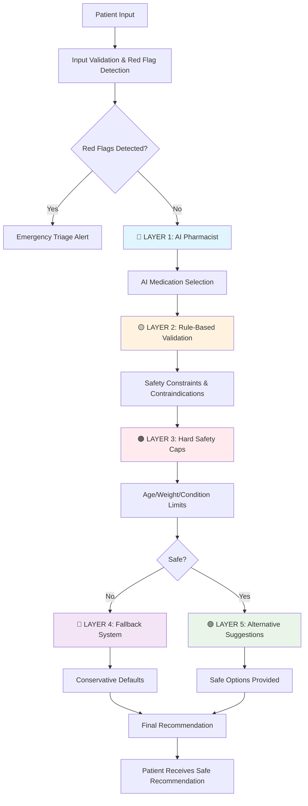

# AbsorpGen AI - Multi-Layer Security Architecture Diagram

## **Visual Representation of Patent-Pending Innovation**

## **Layer-by-Layer Security Flow**

### **🔵 Layer 1: AI Pharmacist (Intelligent Decision Making)**
- **Input:** Patient symptoms, demographics, medical history
- **Process:** GPT-4o-mini analysis with structured JSON output
- **Output:** Intelligent medication recommendation
- **Safety:** Graceful fallback on AI failure

### **🟡 Layer 2: Rule-Based Validation (Deterministic Constraints)**
- **Input:** AI recommendation + patient data
- **Process:** Medical safety rules, contraindication checking
- **Output:** Validated medication choice
- **Safety:** Hard-coded medical rules

### **🟠 Layer 3: Hard Safety Caps (Absolute Medical Limits)**
- **Input:** Validated recommendation + patient factors
- **Process:** Age/weight/condition-based dosing caps
- **Output:** Dose-constrained recommendation
- **Safety:** Never exceeds medical limits

### **🔴 Layer 4: Fallback System (Conservative Defaults)**
- **Input:** Unsafe recommendation
- **Process:** Conservative medication selection
- **Output:** Safe default recommendation
- **Safety:** Always provides safe option

### **🟢 Layer 5: Alternative Suggestions (Safe Options)**
- **Input:** Primary recommendation with concerns
- **Process:** Alternative medication mapping
- **Output:** Multiple safe options
- **Safety:** Backup safe choices

## **Key Patent Innovations**

1. **Multi-Layer Constraint Architecture** - Each layer constrains the previous
2. **AI + Deterministic Hybrid** - Intelligence with guaranteed safety
3. **Context-Aware Routing** - Medication history consideration
4. **Pain-Adaptive Dosing** - Pain level integration
5. **Notes-Aware Processing** - Natural language medication history

## **Security Guarantee**

**No unsafe recommendation can pass through all 5 layers simultaneously.**

Each layer acts as a validation gate, ensuring that even if one layer fails, subsequent layers prevent unsafe recommendations from reaching the patient.

---

*This diagram represents the patent-pending Multi-Layer AI Security Architecture for Medical Recommendations.*
